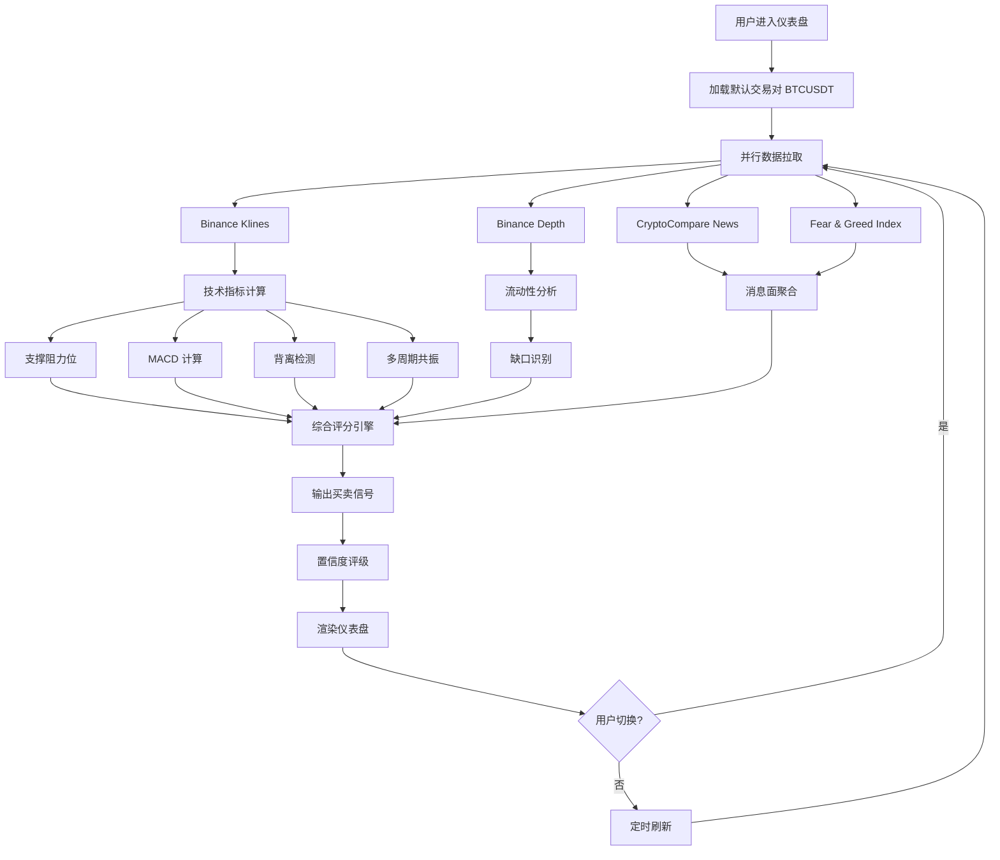

## 1. 产品概述

**加密货币交易分析终端 (CryptoPulse Terminal)** —— 面向专业交易员的多维度实时分析平台。

- 整合技术面（支撑阻力、MACD、背离、缺口、流动性、多时间周期共振）与消息面（新闻聚合、恐惧贪婪指数）的实时决策支持工具
- 目标用户：中高级加密货币交易员、量化研究员，需在秒级内获取多维度共振信号并执行交易决策
- 产品价值：将分散在 TradingView、CoinGlass、各类新闻终端的分析能力整合为单一指挥中心，降低决策延迟与信息噪音

## 2. 核心功能

### 2.1 功能模块概览

| 模块 | 核心能力 | 数据源 |
|------|---------|--------|
| 行情图表 | K线 + 成交量 + 叠加指标 | Binance Klines |
| 支撑阻力 | 自动识别关键价位、聚类分析 | Binance Klines |
| MACD 分析 | 快慢线、柱状图、零轴穿越 | Binance Klines |
| 背离检测 | 顶背离 / 底背离、隐藏背离 | Binance Klines |
| 流动性分析 | 订单簿深度热力图、流动性池识别 | Binance Depth |
| 缺口识别 | 价格缺口、公平价值缺口(FVG) | Binance Klines |
| 多时间周期 | 15m/1h/4h/1d 共振矩阵 | Binance Klines (多周期) |
| 消息面 | 新闻聚合、恐惧贪婪指数 | CryptoCompare / alternative.me |
| 综合信号 | 加权评分、买卖建议、置信度 | 综合计算 |

### 2.2 页面结构

采用**单页密集仪表盘**设计，避免页面跳转打断分析节奏。

1. **仪表盘 (Dashboard)** —— 唯一主页面，分区块集成所有模块
2. **设置抽屉 (Settings Drawer)** —— 侧滑面板，配置 API、参数、权重

### 2.3 页面详情

| 页面 | 模块 | 功能描述 |
|------|------|---------|
| 仪表盘 | 顶部指挥栏 | 交易对搜索、时间周期切换、实时价格、刷新控制 |
| 仪表盘 | 主图表区 | K线图 + 成交量 + 支撑阻力位叠加 + 可选指标层 |
| 仪表盘 | MACD 副图 | 快慢线、柱状图、背离标注、零轴信号 |
| 仪表盘 | 多时间周期共振矩阵 | 4个周期 × 多指标网格，颜色编码共振强度 |
| 仪表盘 | 流动性面板 | 订单簿深度热力图、买卖墙识别、缺口列表 |
| 仪表盘 | 背离检测面板 | 顶/底背离列表、强度评级、历史命中率 |
| 仪表盘 | 消息面流 | 最新新闻列表、恐惧贪婪指数仪表、情绪标签 |
| 仪表盘 | 综合信号卡 | 加权总分、买卖方向、置信度、关键依据 |
| 设置抽屉 | 参数配置 | 指标周期、评分权重、API Key、通知开关 |

## 3. 核心流程

### 3.1 主分析流程

用户打开终端 → 默认加载 BTC/USDT 4h 周期 → 并行拉取 K线/深度/新闻/情绪数据 → 各模块本地计算指标 → 综合评分引擎加权汇总 → 输出买卖建议与置信度 → 用户切换交易对/周期时重新计算

### 3.2 流程图

## 4. 用户界面设计

### 4.1 设计风格

**设计方向：专业交易终端 × 赛博朋克美学**

- **主色调**：深邃黑底 `#0a0e1a`（基底）+ `#131826`（面板）+ 玻璃拟态分层
- **强调色**：
  - 霓虹绿 `#00ff88`（看涨/买入信号）
  - 霓虹红 `#ff3366`（看跌/卖出信号）
  - 电光青 `#00d4ff`（数据高亮/中性）
  - 琥珀黄 `#ffaa00`（警告/关注）
- **字体**：
  - 标题：`Unbounded`（几何感、未来主义、辨识度强）
  - 数据/数字：`JetBrains Mono`（等宽、专业、数字对齐）
  - 正文：`Manrope`（清晰、现代、可读性高）
- **布局**：密集 12 列网格，面板可折叠，关键数据置顶
- **按钮风格**：扁平 + 细边框 + 悬停发光，无 3D 效果
- **图标**：线性图标（Lucide 风格），1.5px 描边
- **动效**：数据更新微闪烁、信号出现脉冲发光、面板入场错位动画

### 4.2 页面设计概览

| 页面 | 模块 | UI 元素 |
|------|------|---------|
| 仪表盘 | 顶部指挥栏 | 深色玻璃栏、交易对搜索框、周期按钮组、实时价格大字显示、涨跌色块 |
| 仪表盘 | 主图表区 | 占据 2/3 宽度，K线 + 支撑阻力水平线（虚线+标签）、成交量副图、十字光标 |
| 仪表盘 | MACD 副图 | 紧贴主图下方，快慢线 + 柱状图（红绿双色），背离点用圆圈标注 |
| 仪表盘 | 共振矩阵 | 右侧 4×N 网格，每格颜色编码信号方向，共振强度用透明度表示 |
| 仪表盘 | 流动性面板 | 深度图（横向条形）+ 缺口列表（带价格区间和类型标签） |
| 仪表盘 | 背离面板 | 卡片列表，每条背离含类型/强度/时间/命中率 |
| 仪表盘 | 消息面 | 左侧新闻流（时间+标题+情绪色块），右侧恐惧贪婪仪表盘（半圆+指针） |
| 仪表盘 | 综合信号卡 | 顶部大卡片，总分 + 方向箭头 + 置信度进度条 + 关键依据列表 |
| 设置抽屉 | 参数配置 | 右侧滑出，分折叠区：指标参数/评分权重/API配置/通知 |

### 4.3 响应式设计

- **桌面优先**：1920×1080 为基准设计，1440 宽度自适应
- **平板适配**：1024 宽度以下面板改为纵向堆叠
- **移动端**：仅保留主图表 + 综合信号 + 消息面，其余折叠

### 4.4 数据可视化细节

- **K线图**：使用 `lightweight-charts`（TradingView 开源库），蜡烛图 + 深度定制主题
- **热力图**：自定义 SVG/Canvas 渲染订单簿深度
- **仪表盘**：SVG 半圆仪表用于恐惧贪婪指数
- **矩阵**：CSS Grid + 颜色映射实现共振矩阵
