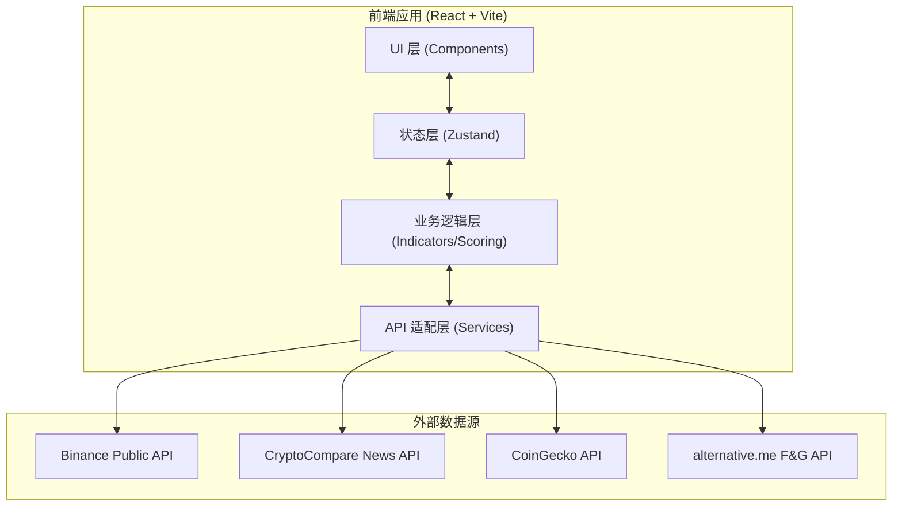
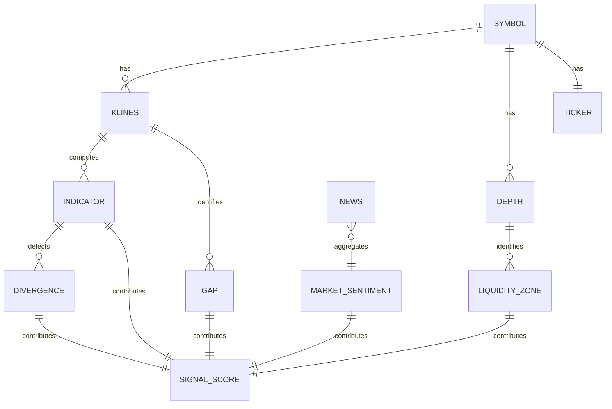

## 1. 架构设计

纯前端架构，直接调用公开 API，无后端服务，降低部署成本与延迟。



## 2. 技术栈说明

| 层级 | 技术选型 | 说明 |
|------|---------|------|
| 框架 | React 18 + TypeScript | 类型安全、组件化 |
| 构建 | Vite 5 | 极速 HMR、ESM 原生 |
| 样式 | TailwindCSS 3 | 原子化、暗色主题变量 |
| 图表 | lightweight-charts 4 | TradingView 开源 K线库，专业级 |
| 辅助图表 | Recharts 3 | 用于深度图、仪表盘等 |
| 状态管理 | Zustand | 轻量、无样板代码 |
| HTTP | Axios | 请求拦截、错误统一处理 |
| 路由 | React Router 6 | 单页应用 |
| 图标 | Lucide React | 线性图标 |
| 工具库 | date-fns, lodash-es | 日期处理、性能优化 |

**初始化工具**：`npm create vite@latest . -- --template react-ts`

## 3. 路由定义

| 路由 | 用途 |
|------|------|
| `/` | 仪表盘主页面（默认加载 BTCUSDT 4h） |
| `/analysis/:symbol` | 指定交易对的深度分析（可选） |

由于采用单页密集仪表盘设计，实际仅一个主路由，交易对切换通过状态更新而非路由跳转。

## 4. API 定义

### 4.1 Binance 公开行情 API（无需 Key，支持 CORS）

```typescript
// K线数据
GET https://api.binance.com/api/v3/klines
params: { symbol: string, interval: '15m'|'1h'|'4h'|'1d', limit: number }
response: [[openTime, open, high, low, close, volume, closeTime, ...], ...]

// 订单簿深度
GET https://api.binance.com/api/v3/depth
params: { symbol: string, limit: 100|500|1000 }
response: { lastUpdateId, bids: [[price, qty], ...], asks: [[price, qty], ...] }

// 24h 行情
GET https://api.binance.com/api/v3/ticker/24hr
params: { symbol: string }
response: { lastPrice, priceChangePercent, highPrice, lowPrice, volume, ... }
```

### 4.2 CryptoCompare 新闻 API（免费层，支持 CORS）

```typescript
GET https://min-api.cryptocompare.com/data/v2/news/?lang=EN&categories=BTC,ETH
response: { Data: [{ id, title, body, url, source, published_on, categories, ... }] }
```

### 4.3 Fear & Greed Index（alternative.me，免费，支持 CORS）

```typescript
GET https://api.alternative.me/fng/?limit=30
response: { data: [{ value: '0-100', value_classification: 'Fear|Greed|...', timestamp }] }
```

### 4.4 CoinGecko 备用（新闻与价格聚合）

```typescript
GET https://api.coingecko.com/api/v3/news/status
// 用于补充与降级方案
```

## 5. 数据模型

### 5.1 核心数据模型



### 5.2 TypeScript 类型定义

```typescript
// K线数据
interface Candle {
  time: number;      // 开盘时间 (秒)
  open: number;
  high: number;
  low: number;
  close: number;
  volume: number;
}

// 支撑阻力位
interface SupportResistance {
  price: number;
  type: 'support' | 'resistance';
  strength: number;   // 1-5，触碰次数与成交量加权
  touches: number;    // 触碰次数
  lastTouch: number;  // 最后触碰时间
}

// MACD 指标
interface MACDData {
  macd: number;
  signal: number;
  histogram: number;
  time: number;
  crossover?: 'bullish' | 'bearish';  // 交叉信号
}

// 背离
interface Divergence {
  type: 'regular_bearish' | 'regular_bullish' | 'hidden_bearish' | 'hidden_bullish';
  startTime: number;
  endTime: number;
  priceHigh: number;
  priceLow: number;
  indicatorHigh: number;
  indicatorLow: number;
  strength: 'weak' | 'medium' | 'strong';
}

// 流动性区间
interface LiquidityZone {
  priceLow: number;
  priceHigh: number;
  side: 'bid' | 'ask';
  totalQty: number;
  isWall: boolean;      // 是否为买卖墙
  distancePct: number;  // 距当前价百分比
}

// 缺口
interface Gap {
  type: 'price_gap' | 'fvg';  // 价格缺口 / 公平价值缺口
  startTime: number;
  endTime: number;
  topPrice: number;
  bottomPrice: number;
  filled: boolean;
}

// 多周期共振信号
interface TimeframeSignal {
  timeframe: '15m' | '1h' | '4h' | '1d';
  trend: 'bullish' | 'bearish' | 'neutral';
  macdSignal: 'bullish' | 'bearish' | 'neutral';
  rsiSignal: 'overbought' | 'oversold' | 'neutral';
  resonance: number;  // 共振强度 0-100
}

// 综合信号评分
interface SignalScore {
  total: number;          // 0-100
  direction: 'long' | 'short' | 'neutral';
  confidence: number;     // 0-100
  components: {
    technical: number;    // 技术面得分
    liquidity: number;    // 流动性得分
    divergence: number;   // 背离得分
    sentiment: number;    // 情绪得分
    timeframe: number;    // 多周期得分
  };
  reasons: string[];      // 关键依据
  timestamp: number;
}

// 消息面
interface NewsItem {
  id: string;
  title: string;
  source: string;
  url: string;
  publishedOn: number;
  categories: string[];
  sentiment?: 'positive' | 'negative' | 'neutral';
}

interface FearGreedIndex {
  value: number;              // 0-100
  classification: string;     // Extreme Fear ... Extreme Greed
  timestamp: number;
  yesterday: number;
  lastWeek: number;
}
```

## 6. 核心算法说明

### 6.1 支撑阻力位识别

```typescript
// 基于局部极值点 + 聚类
// 1. 用 pivots(higher_highs/lower_lows) 识别关键点
// 2. 对价格做密度聚类（容差 0.5%）
// 3. 触碰次数 + 成交量加权强度
```

### 6.2 MACD 计算

```typescript
// 标准参数 12/26/9
// EMA12 - EMA26 = MACD 线
// MACD 线的 9日 EMA = 信号线
// MACD - 信号 = 柱状图
// 交叉信号：MACD 上穿/下穿信号线
```

### 6.3 背离检测

```typescript
// 顶背离：价格创新高，MACD 未创新高
// 底背离：价格创新低，MACD 未创新低
// 隐藏背离：价格更高高点 + MACD 更低高点（趋势延续）
// 强度：基于背离跨度与幅度
```

### 6.4 综合评分引擎

```typescript
// 加权评分
const weights = {
  technical: 0.30,    // MACD + 趋势
  divergence: 0.20,   // 背离信号
  liquidity: 0.20,    // 流动性位置
  timeframe: 0.20,    // 多周期共振
  sentiment: 0.10,    // 消息面
};
// 各模块输出 -100 到 +100 分数
// 加权汇总后映射到 0-100 + 方向
// 置信度 = 各模块方向一致性
```

## 7. 项目结构

```
src/
├── components/
│   ├── layout/           # 布局组件
│   ├── chart/            # 图表组件
│   ├── panels/           # 各分析面板
│   └── ui/               # 基础 UI 组件
├── services/             # API 适配层
│   ├── binance.ts
│   ├── news.ts
│   └── sentiment.ts
├── lib/
│   ├── indicators/       # 指标计算
│   │   ├── macd.ts
│   │   ├── supportResistance.ts
│   │   ├── divergence.ts
│   │   └── gaps.ts
│   ├── liquidity/        # 流动性分析
│   ├── scoring/          # 综合评分
│   └── utils/
├── store/                # Zustand 状态
├── types/                # TypeScript 类型
├── hooks/                # 自定义 Hooks
├── App.tsx
└── main.tsx
```

## 8. 性能与优化

- **数据缓存**：K线数据缓存 5 分钟，深度数据 10 秒
- **请求节流**：切换交易对时取消未完成请求（AbortController）
- **指标计算**：memoize 避免重复计算
- **图表渲染**：lightweight-charts 自带 GPU 加速
- **轮询策略**：默认 30 秒刷新，可手动暂停
